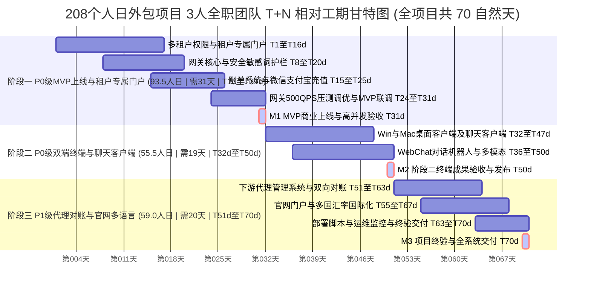

# AI 模型 API 中转中台与应用平台
## 产品功能规格说明书与子项设计手册 (FRS V3.4 终极整合版)
### —— 面向业务决策者与非技术客户

---

## 一、 文档说明、工时计算思路与 四级分层架构模型

### 1.1 工时与工作量计算思路与评估依据

本说明书针对本token 聚合平台的业务决策者、客户及产品运营团队编写，从**解决用户核心痛点、原始需求精准对照、交互界面、业务流程与管理功能**出发，对项目中的 **11 大核心功能模块、共 58 个细分功能子项** 进行逐一设计与说明。

为了让采购方与技术评审专家清晰了解每一项工时的来源与评估合理性，本文档对全量 58 个子项均给出了**【评估计算思路】**。特别是针对 **`【sub2api 匹配度】：部分满足`的子项**，采用了**三段式对比推导**：
1. **【已满足的基础与实现机制】**：明确点出 `sub2api` 原生开源代码中已包含的数据模型、框架与基础服务（避免重复造轮子，复用已有代码）；
2. **【需二次改造的差距与研发内容】**：精准列出为了满足本项目特定商业需求必须补充的业务逻辑、数据持久化重构或前端 UI（证明开发的必要性）；
3. **【工作量合理性推导】**：结合复用基础与改造差距，推导出评估工时的合理性与闭环依据。

总体工作量计算遵循以下量化公式与四大评估维度：

> **子项评估总工时** = **产品原型与测试工时 (PM/QA)** + **后端架构与接口工时 (BE)** + **前端/桌面端 GUI 工时 (FE)**

所有 58 个功能子项均包含以下 **7 大标准化核心要素**：
1. **【解决的痛点】**：业务、用户或技术真实遇到的瓶颈问题；
2. **【功能描述】**：说明该功能的核心逻辑与交付价值；
3. **【业务规则与交互设计】**：明确 UI/UX 体验与后台控制逻辑；
4. **【sub2api 匹配度】**：标明开箱即用、二次开发或全新研发状态；
5. **【已满足的基础与实现机制】**（针对部分满足子项）：详述开源原生已有的能力；
6. **【需二次改造的差距与研发内容】**（针对部分满足子项）：详述本项目需新增/重构的模块；
7. **【工时与岗位及评估计算思路】**：推导该工时分配的具体研发拆解与合理性。

### 1.2 四级分层架构模型

```
┌────────────────────────────────────────────────────────────────────────────────┐
│ 1. 平台顶级控制层 (Platform Level)                                               │
│    - 全局上游号池接入、平台底价设置、代理商资质审核与抽成策略                           │
└───────────────────────┬────────────────────────────────────────────────────────┘
                        │
┌───────────────────────▼────────────────────────────────────────────────────────┐
│ 2. 渠道代理商控制层 (Agent Channel Level)                                         │
│    - 代理专属控制台、自主招募企业租户/普通用户、配置代理加价率、专属号池绑定               │
└───────────────────────┬────────────────────────────────────────────────────────┘
                        │
┌───────────────────────▼────────────────────────────────────────────────────────┐
│ 3. 企业/组织租户控制层 (Tenant / Organization Level)                              │
│    - 企业独立数据隔离、企业管理员控制台、员工子账号创建与二次额度划拨、国际化 (i18n)       │
└───────────────────────┬────────────────────────────────────────────────────────┘
                        │
┌───────────────────────▼────────────────────────────────────────────────────────┐
│ 4. 终端使用者 / API Key 层 (End User / API Key Level)                            │
│    - 普通用户 API Key 调用、桌面一键部署客户端、网页版对话机器人、官网门户与文档中心       │
└───────────────────────┬────────────────────────────────────────────────────────┘
                        │
┌───────────────────────▼────────────────────────────────────────────────────────┐
│ 支撑引擎与集成交付层 (Engines & QA Integration Level)                             │
│    - Engine A: 核心模型网关智能调度、亲和路由与向量语义缓存引擎                        │
│    - Engine B: 多级穿透扣费、日周月账单自动推送与微信/支付宝在线充值                    │
│    - Testing & QA: 全系统端到端链路集成、高并发高吞吐压测与生产环境搭建                 │
└────────────────────────────────────────────────────────────────────────────────┘
```


---

## 二、 11 大核心模块及 58 个子功能项详细设计

---

### 2.1 中转站中台（共需 3.5 人日）

> **模块定位**：核心网关层，模型请求转发与基础能力支撑。

#### 【子项 2.1.1 API 接口协议转换（OpenAI/Claude/Gemini/Grok）】
- **解决的痛点**：第三方客户端或开发工具与上游异构 API 协议不兼容，需针对每个模型重新对接，接入成本极高。
- **功能描述**：平台提供标准的 API 接口地址。无论用户或第三方软件传入 OpenAI、Anthropic Claude、Google Gemini 还是 Grok 格式的请求，中台均能自动识别并转换为上游目标模型能听懂的语言，实现“一次接入，全模型通用”。
- **业务规则与交互**：客户端配置统一 URL（如 `https://api.yourdomain.com/v1`）；系统自动匹配目标模型并透明转发。
- **sub2api 匹配度**：**完全满足 (原生自带)**。已完美支持各大主流模型协议转换。
- **工时与岗位**：**0.5 人日** (后端: 0.5)。
- **评估计算思路**：原生完全满足，无需代码改动，仅分配后端 0.5 天用于转换协议联通性校验。

#### 【子项 2.1.2 智能路由与负载均衡】
- **解决的痛点**：单一上游渠道并发吞吐受限或出现单点故障，导致用户调用请求堆积卡顿。
- **功能描述**：当同一个模型（如 gpt-4o）绑定了多个上游渠道号池时，系统自动将用户的请求均匀分摊到各个可用渠道上，防止单个渠道超载卡顿。
- **业务规则与交互**：后台可配置轮询与权重策略；前台调用无感知，自动获得最流畅响应。
- **sub2api 匹配度**：**完全满足 (原生自带)**。内置轮询、权重与并发调度算法。
- **工时与岗位**：**0.5 人日** (后端: 0.5)。
- **评估计算思路**：原生自带轮询算法，分配后端 0.5 天用于配置默认权重及多通道并发转发联调。

#### 【子项 2.1.3 API Key 鉴权与额度校验】
- **解决的痛点**：缺乏统一鉴权与余额实时控制，容易导致未经授权的非法调用、接口盗刷与欠费坏账风险。
- **功能描述**：用户在调用 API 时必须携带平台颁发的密钥 (API Key)。中台在秒级内验证 Key 的合法性、剩余余额及使用权限，只有合规请求才予放行。
- **sub2api 匹配度**：**完全满足 (原生自带)**。
- **工时与岗位**：**0 人日**（开箱即用）。
- **评估计算思路**：原生核心鉴权引擎完全满足，无需额外研发预算。

#### 【子项 2.1.4 调用日志与明细查询】
- **解决的痛点**：缺乏全链路调用日志记录，技术排查定位困难，且存在敏感对话原文泄漏的合规隐患。
- **功能描述**：后台实时记录每一笔调用的详细账目，包括调用时间、使用者、调用的模型名称、消耗的输入/输出 Token 数量、响应时长以及成功/失败状态。支持敏感数据脱敏配置，不存储用户对话原文。
- **sub2api 匹配度**：**完全满足 (原生自带)**。
- **工时与岗位**：**0.5 人日** (后端: 0.5)。
- **评估计算思路**：原生具备日志落盘能力，分配后端 0.5 天用于脱敏配置开关校验。

#### 【子项 2.1.5 频率限制（Rate Limit）与熔断】
- **解决的痛点**：异常高频调用攻击或上游故障导致服务雪崩，网关响应延迟剧烈飙升。
- **功能描述**：当某个 Key 的频次超出限制，系统会自动限流；当某个上游渠道频繁报错，系统会自动暂停调用该渠道（熔断），确保网关平均响应时延 P95 ≤ 上游原始时延 + 50ms。
- **sub2api 匹配度**：**完全满足 (原生自带)**。
- **工时与岗位**：**2.0 人日** (产品: 0.5, 后端: 1.0, 前端: 0.5)。
- **评估计算思路**：原生已具备基础熔断逻辑，分配 2.0 天用于 P95≤50ms 压测调优验证及前端告警状态呈现。

---

### 2.2 一键部署客户端（Windows / macOS 专属客户端）（共需 32.5 人日）

> **模块定位**：面向零技术背景的普通用户，提供双击即用、本平台线路/Key无感秒切、自动注入配置与图形化网络诊断的极致桌面体验。

#### 【子项 2.2.1 双击即用与系统托盘常驻】
- **解决的痛点**：用户使用本平台服务时每次都要打开浏览器或独立应用窗口，操作路径繁琐且占用桌面空间。
- **功能描述**：提供 Windows (.exe/.msi) 和 macOS (.dmg) 双端极速安装包。软件启动后自动收起常驻系统托盘（Win 任务栏右下角 / macOS 状态栏）。点击托盘图标弹出快捷悬浮控制面板，实时展示本平台连接状态，支持鼠标单击秒级切换本平台服务线路/Key、重新测试延迟与一键开关代理。
- **sub2api 匹配度**：**完全缺失 (全新研发)**。基于轻量级跨平台桌面原生运行环境研发。
- **工时与岗位**：**4.0 人日** (产品: 1.0, 后端: 1.0, 前端: 2.0)。
- **评估计算思路**：完全缺失需从零开发。前端需 2.0 天开发托盘通信与悬浮面板，产品需 1.0 天设计双端交互原型，后端需 1.0 天提供托盘状态鉴权接口，合计 4.0 人日。

#### 【子项 2.2.2 多节点/多账号快捷切换】
- **解决的痛点**：用户在本平台拥有多个不同用途的 API Key 或不同线路（如“默认生产线路”、“VIP极速专线”、“开发测试 Key”）时，频繁手动修改配置极易出错。
- **功能描述**：针对当前用户对不同线路的不同 API KEY 进行统一管理，支持按需选择对应的 API KEY 应用到不同的本地 AI 工具中（包括本地聊天客户端使用的 API KEY 也在此处选择）。同时作为查看用户在 sub2api 中用户基本信息的统一入口。支持用户在客户端内部预设并保存多套配置预设卡片，滑动开关即可秒级无感切换当前生效的本平台线路配置。
- **sub2api 匹配度**：**完全缺失 (全新研发)**。
- **工时与岗位**：**5.0 人日** (产品: 1.0, 前端: 4.0)。
- **评估计算思路**：前端需 4.0 天开发 Profile 预设卡片、本地 JSON 加密持久化及热重载通信，产品需 1.0 天进行无感切换边界验收，合计 5.0 人日。

#### 【子项 2.2.3 环境检测与配置一键注入】
- **解决的痛点**：小白用户不懂如何在本地 AI 工具（如 Claude Code、Codex、Gemini CLI、OpenClaw 和 Hermes插件）中配置本平台的 API 地址和 Key。
- **功能描述**：客户端内置环境检测引擎，自动识别扫描本地已安装的各大 AI 客户端与开发环境，提供【一键绑定本平台】功能，自动将本平台的 API Base URL 与当前激活的 Key 写入各工具配置文件或系统环境变量中，实现零命令行开箱即用。
- **sub2api 匹配度**：**完全缺失 (全新研发)**。
- **工时与岗位**：**4.5 人日** (产品: 1.0, 后端: 1.5, 前端: 2.0)。
- **评估计算思路**：后端需 1.5 天编写各种 CLI/IDE 配置文件扫描脚本，前端需 2.0 天渲染注入引导 UI，产品需 1.0 天进行多开发环境覆盖测试，合计 4.5 人日。

#### 【子项 2.2.4 图形化延迟测速大盘】
- **解决的痛点**：无法直观感知本平台各个网关线路的实时响应速度与连通状态。
- **功能描述**：内置高精度并发测试工具，对本平台提供的各个网关入口线路进行实时延迟测试。采用鲜明色块（绿色 <100ms 极速 / 黄色 100-300ms 良好 / 红色 >300ms 超时）直观展现线路健康度，并自动标注推荐当前最佳响应线路。
- **sub2api 匹配度**：**完全缺失 (全新研发)**。
- **工时与岗位**：**4.0 人日** (产品: 1.0, 前端: 3.0)。
- **评估计算思路**：前端需 3.0 天开发并发 Ping 测速组件及色块排行榜，产品 1.0 天测试测速精度，合计 4.0 人日。

#### 【子项 2.2.5 客户端版本更新】
- **解决的痛点**：网关协议升级后，用户本地客户端因版本过旧出现不兼容报错，用户难以手动升级。
- **功能描述**：软件每次启动时在后台静默与本平台云端服务器比对最新版本。发现新版本时弹出新特性日志提示，支持增量静默下载、一键覆盖升级与本地服务热重载。
- **sub2api 匹配度**：**完全缺失 (全新研发)**。
- **工时与岗位**：**3.5 人日** (产品: 1.0, 后端: 1.0, 前端: 1.5)。
- **评估计算思路**：后端 1.0 天搭建 Release 检查接口，前端 1.5 天集成静默更新解压器，产品 1.0 天验证升级流程，合计 3.5 人日。

#### 【子项 2.2.6 排查指引与日志抓包】
- **解决的痛点**：遇到请求异常或网络阻断时抛出晦涩技术代码，小白用户完全看不懂，也无法提供有效日志给客服。
- **功能描述**：客户端在本地自动拉起轻量级中转代理服务，监听指定端口。内置可视化的抓包与请求日志视窗，供高级用户查看数据流与耗时。报错时生成小白看懂的原因卡片（如：“本平台余额不足”、“Key 权限受限”）并提供排查指引助手。
- **sub2api 匹配度**：**完全缺失 (全新研发)**。
- **工时与岗位**：**4.0 人日** (产品: 1.0, 前端: 3.0)。
- **评估计算思路**：前端需 3.0 天开发本地代理日志视窗与错误码白话转换引擎，产品 1.0 天整理白话排查文案，合计 4.0 人日。

#### 【子项 2.2.7 聊天机器人客户端】
- **解决的痛点**：终端用户希望直接在桌面专属客户端中使用 AI 对话聊天功能，无需打开网页版或配置复杂的第三方软件。
- **功能描述**：将【2.3 网页版对话机器人】的核心功能（模型选择、Prompt 预设标签、多轮会话管理、多模态附件上传与图文对话）全面移植并集成至 Windows / macOS 专属桌面客户端中，实现原生级多平台桌面客户端聊天体验。
- **sub2api 匹配度**：**完全缺失 (全新研发)**。
- **工时与岗位**：**7.5 人日** (产品: 2.0, 后端: 1.5, 前端: 4.0)。
- **评估计算思路**：基于网页版对话机器人的核心业务逻辑，因涉及跨平台桌面端（Electron/Tauri）适配、桌面本地渲染优化及快捷键交互，工作量按网页版对话机器人（23 人日）的 1/3 进行评估（约 7.5 人日）。

---

### 2.3 网页版对话机器人（共需 23.0 人日）

> **模块定位**：基于中转站网关能力的 Web 端对话产品，用户登录后即可直接使用，内置任务分类与智能模型匹配策略。

#### 【子项 2.3.1 用户账户体系：注册、登录、会话持久化】
- **解决的痛点**：用户更换浏览器或设备后对话历史遗失，无法进行持续会话。
- **功能描述**：支持邮箱、手机验证码或第三方授权登录。登录后对话历史保存在云端，换设备即刻同步。
- **sub2api 匹配度**：**部分满足**。
- **已满足的基础与实现机制**：`sub2api` 原生提供了标准令牌身份验证与基础账号数据模型，具备基本的登录鉴权控制。
- **需二次改造的差距与研发内容**：原生缺少云端多端会话历史持久化存储与跨设备热同步。需要构建云端多端会话历史持久化数据模型、双向实时通讯与数据同步服务，并在前端接入云端状态管理。
- **工时与岗位**：**3.0 人日** (产品: 1.0, 后端: 1.0, 前端: 1.0)。
- **评估计算思路**：在已有身份认证基础上，只需 3.0 人日专注实现会话云端同步与多端校验。

#### 【子项 2.3.2 任务分类入口：简单对话、文档整理、图片处理等预设场景标签】
- **解决的痛点**：普通用户面对空白输入框不知如何撰写 Prompt，提问效果极差。
- **功能描述**：提供预设的场景快捷分类标签（简单对话、文档整理、代码编写、图片生成、翻译润色），点击自动填入引导词。分类与匹配策略支持运营侧可配置化动态调整。
- **sub2api 匹配度**：**完全缺失 (全新研发)**。
- **工时与岗位**：**3.0 人日** (产品: 1.0, 前端: 2.0)。
- **评估计算思路**：前端 2.0 天开发标签卡片选择与 Prompt 自动填入组件，产品 1.0 天设计预设标签列表，合计 3.0 人日。

#### 【子项 2.3.3 智能模型匹配：根据任务分类自动推荐最优模型策略】
- **解决的痛点**：非技术用户搞不懂各大模型能力差异，容易选错模型导致效果不佳或浪费资费。
- **功能描述**：选择场景后，系统根据运营配置自动推荐匹配最适合的模型（如图片场景自动推荐 `gpt-4o-vision` 或 `dall-e-3`）。
- **sub2api 匹配度**：**完全缺失 (全新研发)**。
- **工时与岗位**：**3.0 人日** (产品: 1.0, 后端: 1.0, 前端: 1.0)。
- **评估计算思路**：后端 1.0 天提供场景-模型映射配置接口，前端 1.0 天渲染推荐高亮，产品 1.0 天策划推荐算法逻辑，合计 3.0 人日。

#### 【子项 2.3.4 模型手动切换：用户可自主选择指定模型进行对话】
- **解决的痛点**：专业用户在处理特定专业任务时，无法快速自主挑选特定厂商或擅长的模型。
- **功能描述**：高级用户可在顶栏自由切换模型，支持按品牌（OpenAI/Claude/Gemini）或能力偏好筛选。
- **sub2api 匹配度**：**部分满足**。
- **已满足的基础与实现机制**：`sub2api` 后端提供了可调用模型的列表查询 API，前端具备基础的极简下拉列表。
- **需二次改造的差距与研发内容**：原生缺乏网页端开箱即用的品牌分类下拉筛选器（OpenAI/Claude/Gemini 品牌分类）、能力标签筛选（视觉/长上下文）以及模型说明卡片。需前端二次开发全新的模型选择器 UI 与分类缓存状态。
- **工时与岗位**：**2.0 人日** (前端: 2.0)。
- **评估计算思路**：后端 API 开箱即用，只需前端 2.0 人日专注搭建可视化响应式选择组件。

#### 【子项 2.3.5 多轮对话上下文管理与会话历史】
- **解决的痛点**：长对话中缺少有效的上下文管理，且历史会话杂乱无章难以快速检索。
- **功能描述**：左侧提供会话列表，自动提取首句为标题，支持新建、重命名、置顶与删除，记忆上下文。
- **sub2api 匹配度**：**部分满足**。
- **已满足的基础与实现机制**：`sub2api` 网关具备基础的对话上下文 Token 拼接算法（能够在转发上游时截断超长对话）。
- **需二次改造的差距与研发内容**：网页侧缺乏左侧历史会话树、标题自动提炼算法、置顶/重命名/归档以及滑动加载历史记录。需前端开发完整的会话树组件，后端提供对话历史 CURD 与自动命名服务。
- **工时与岗位**：**4.0 人日** (产品: 1.0, 后端: 1.0, 前端: 2.0)。
- **评估计算思路**：利用网关底层上下文截断能力，评估 4.0 人日重点攻坚 Web 端的会话树与历史管理。

#### 【子项 2.3.6 多模态输入支持：文本、图片、文件上传】
- **解决的痛点**：纯文本交互无法满足识别看图、解析 PDF 论文和 Word 文档等高频复杂场景。
- **功能描述**：支持发送文字，允许拖拽/粘贴上传图片识图或 PDF/DOCX 文档进行摘要与长文档答疑。
- **sub2api 匹配度**：**部分满足**。
- **已满足的基础与实现机制**：`sub2api` 网关原生支持透传带图片 Base64 的 Vision JSON 报文及文件解析转发。
- **需二次改造的差距与研发内容**：Web 界面缺乏拖拽上传附件、剪贴板粘贴图片实时预览、PDF/Word 本地提取摘要解析器以及文件 Token 消耗实时计算预估。
- **工时与岗位**：**5.0 人日** (产品: 1.0, 后端: 1.0, 前端: 3.0)。
- **评估计算思路**：基于后端网关透传能力，评估 5.0 人日集中研发 Web 端的前端附件解析与渲染体验。

#### 【子项 2.3.7 对话导出与分享（可选）】
- **解决的痛点**：优质对话成果无法便捷分享给团队同事或导出备份。
- **功能描述**：精彩对话可一键导出为 Markdown/长图，或生成公开分享链接供他人查看。
- **sub2api 匹配度**：**完全缺失 (全新研发)**。
- **工时与岗位**：**3.0 人日** (产品: 1.0, 后端: 1.0, 前端: 1.0)。
- **评估计算思路**：前端 1.0 天开发 Canvas 渲染长图与 Markdown 导出，后端 1.0 天生成公开匿名分享短链，产品 1.0 天测试分享权限，合计 3.0 人日。

---

### 2.4 官网门户（共需 9.0 人日）

> **模块定位**：产品对外展示与获客的官方站点，承担品牌介绍、模型报价、使用教程与用户转化的核心职能。所有静态页面均支持主题风格化与多国语言 (i18n)。

#### 【子项 2.4.1 首页：产品核心功能介绍、价值主张、CTA 引导】
- **解决的痛点**：缺少官方获客阵地与清晰的价值主张传递，导致潜在客户流失率高。
- **功能描述**：展示产品优势（高可用、低延时、智能降本）与免费试用 CTA 引导入口，采用响应式布局，支持多国语言与主题风格切换。
- **sub2api 匹配度**：**完全缺失 (全新研发)**。基于已有页面基础进行静态改造与文案优化。
- **工时与岗位**：**1.0 人日** (前端: 1.0)。
- **评估计算思路**：已有前端静态页面基础，分配 1.0 人日进行 Landing Page 文案调整、主题样式适配与多国语言标签接入。

#### 【子项 2.4.2 模型广场：支持的模型列表、能力说明与阶梯报价】
- **解决的痛点**：上游模型能力与 Token 阶梯报价不透明，且从底层中台实时联动查询拉取耗时高、缺乏独立维护灵活性。
- **功能描述**：单独设计与维护模型广场数据库，独立管理展示平台支持的模型列表、能力说明、上下文长度、能力标签及阶梯报价，免去与 sub2api 后端网关的强联动约束。
- **sub2api 匹配度**：**完全缺失 (全新研发)**。设计独立的模型广场数据库与管理后台。
- **工时与岗位**：**5.0 人日** (后端: 2.0, 前端: 3.0)。
- **评估计算思路**：后端需 2.0 天设计模型广场独立数据库 Schema 与 CRUD 管理接口，前端需 3.0 天开发公开免登录模型大盘、交互式 Token 计算器及筛选器。

#### 【子项 2.4.3 文档中心：安装教程、使用指南、API 文档】
- **解决的痛点**：缺乏结构化接入教程，导致技术客服日常解答重复问题负担极重。
- **功能描述**：结构化响应式知识库与文档中心站点，包含客户端安装教程、使用指南、API 接入步骤及 FAQ，支持多语言与主题切换。
- **sub2api 匹配度**：**部分满足**。
- **已满足的基础与实现机制**：开源社区提供了零散的接口接入说明文档。
- **需二次改造的差距与研发内容**：在已有静态文档站点基础上完成文案微调、美化主题风格并接入多国语言。
- **工时与岗位**：**1.0 人日** (前端: 1.0)。
- **评估计算思路**：基于已有文档框架，评估 1.0 人日完成文案更新、多语言适配与静态站点编译。

#### 【子项 2.4.4 定价页：套餐对比与购买入口】
- **解决的痛点**：缺乏透明的套餐对比与在线直购充值入口，付费转化路径长。
- **功能描述**：展示套餐对比表格（入门版、专业版、企业版）并提供在线购买充值入口，支持多国语言与货币符号适配。
- **sub2api 匹配度**：**部分满足**。
- **已满足的基础与实现机制**：静态 Pricing 矩阵页面组件。
- **需二次改造的差距与研发内容**：对定价展示矩阵进行静态样式增强、文案调整及多语言转化按钮绑定。
- **工时与岗位**：**1.0 人日** (前端: 1.0)。
- **评估计算思路**：评估 1.0 人日完成 Pricing 对比表文案精修、主题风格化及多语言切换支持。

#### 【子项 2.4.5 关于/联系我们：企业信息与客服联系方式】
- **解决的痛点**：缺少企业背书与售后服务通道，客户缺乏信任感。
- **功能描述**：展示企业信息、服务条款、隐私政策及客服联系方式（微信/Telegram/在线表单），支持主题风格与多语言。
- **sub2api 匹配度**：**完全缺失 (全新研发)**。
- **工时与岗位**：**1.0 人日** (前端: 1.0)。
- **评估计算思路**：基于已有静态模板，评估 1.0 人日进行企业文案微调、富文本条款展示与多语言词条绑定。

---

### 2.5 核心模型网关能力补全（共需 20.0 人日）

> **模块定位**：在网关基础转发能力之上，提供安全合规与敏感词防拦截护栏服务，解决内容审核与长效合规审计需求。

#### 【子项 2.5.1 安全敏感词护栏】
- **解决的痛点**：生成式 AI 模型给最终用户生成内容或接收用户输入时存在违规风险，上游原始模型缺乏合规过滤，且 sub2api 完全缺失敏感词拦截与合规审计能力。
- **功能描述**：基于输入提示词（Prompt）与上游模型输出内容（Completion）进行双向实时敏感词拦截。系统接驳网信办给到的标准敏感词数据库，支持管理员动态热增加/删除违规词库规则（无需重启服务）。一旦命中违规敏感词立即阻断请求并返回合规提示，同时自动生成完整的安全审计日志，落盘保存并提供长期存档与溯源能力。
- **sub2api 匹配度**：**完全缺失 (全新研发)**。
- **工时与岗位**：**20.0 人日** (产品: 2.0, 后端: 15.0, 前端: 3.0)。
- **评估计算思路**：后端需 15.0 天研发高性能网关流式输入/输出敏感词双向检测引擎、网信办热加载词库匹配算法（Aho-Corasick）、异步审计日志持久化落盘与长期归档索引服务；前端需 3.0 天开发动态热增加敏感词库管理界面与审计日志查询面板；产品需 2.0 天梳理合规审计拦截规则并进行高并发拦截准确率测试，合计 20.0 人日。

---

### 2.6 账单系统（共需 14.5 人日）

> **模块定位**：为客户提供清晰、透明、可追溯的用量计费与账单查询能力，支持商业化结算，达成数据与网关日志双向对账零误差。

#### 【子项 2.6.1 用量计量：按模型、按 Token 粒度的精确计费】
- **解决的痛点**：扣费粒度粗糙、无法准确穿透计算平台底价、代理加价与租户扣费，容易产生财务纠纷。
- **功能描述**：按 Prompt/Completion/Cached Tokens 精确扣费，支持多级穿透分账（平台底价 -> 渠道加价 -> 租户核算 -> 员工扣减）。
- **sub2api 匹配度**：**部分满足**。
- **已满足的基础与实现机制**：`sub2api` 具备基础的扣费引擎，可按照上游返回的 Token 数量扣减用户个人额度。
- **需二次改造的差距与研发内容**：原生无法处理“平台底价 -> 渠道加价 -> 企业租户核算 -> 员工额度扣减”的多级穿透分账逻辑，且不支持 Cached Prompt 折扣计费。需重构网关多级穿透分账与计算引擎。
- **工时与岗位**：**3.5 人日** (产品: 1.0, 后端: 2.5)。
- **评估计算思路**：保留网关扣费主流程，评估 3.5 人日专注重构多级分账公式与账目校验。

#### 【子项 2.6.2 日/周/月账单自动生成与推送】
- **解决的痛点**：人工统计对账极度耗时，无法自动化定期出具结算账单。
- **功能描述**：定时汇总用量明细生成日/周/月账单报告，自动推送至用户及管理层邮箱。
- **sub2api 匹配度**：**部分满足**。
- **已满足的基础与实现机制**：后台数据库持久化保存了每笔调用的日志粒度记录。
- **需二次改造的差距与研发内容**：缺少周期性异步定时汇总计算引擎、HTML/PDF 格式的邮件账单渲染模板以及针对企业管理员的自动化邮件推送服务。
- **工时与岗位**：**2.0 人日** (后端: 2.0)。
- **评估计算思路**：依托现有日志明细表，评估 2.0 人日专门编写定时任务聚合算法与邮件推送服务。

#### 【子项 2.6.3 账单可视化：用量趋势图、模型占比分布、费用明细】
- **解决的痛点**：纯文字账单不直观，企业客户无法直观把控团队消费趋势与主要支出模型。
- **功能描述**：图表大盘展示消费折线趋势图、模型占比饼图与调用明细账单。
- **sub2api 匹配度**：**完全满足 (原生自带)**。
- **工时与岗位**：**1.0 人日** (前端: 1.0)。
- **评估计算思路**：原生已具备基础图表，前端 1.0 天调整图表时间筛选维度，评估为 1.0 人日。

#### 【子项 2.6.4 账单导出：支持 CSV / PDF 格式下载】
- **解决的痛点**：缺少规范格式明细导出，企业客户无法完成内部财务报销与审计。
- **功能描述**：支持一键导出 CSV 或 PDF 格式消费对账单，满足财务报销与审计需求。
- **sub2api 匹配度**：**部分满足**。
- **已满足的基础与实现机制**：`sub2api` 提供了管理后台的分页查询接口。
- **需二次改造的差距与研发内容**：缺乏针对大容量消费明细的后端流式导出接口，以及带有企业公章/抬头样式的规范 PDF 账单打印渲染器。
- **工时与岗位**：**1.5 人日** (后端: 1.0, 前端: 0.5)。
- **评估计算思路**：评估 1.5 人日快速开发后端流式导出与前端下载器。

#### 【子项 2.6.5 余额预警与欠费停服机制】
- **解决的痛点**：用户在不知情下余额耗尽导致突发停服，或欠费透支造成平台财务损失。
- **功能描述**：余额低于设定的预警线时触发多渠道通知，归零自动暂停 Key 权限。
- **sub2api 匹配度**：**完全满足 (原生自带)**。
- **工时与岗位**：**0.5 人日** (后端: 0.5)。
- **评估计算思路**：原生自带预警逻辑，后端分配 0.5 天校验停服阈值动作，评估为 0.5 人日。

#### 【子项 2.6.6 充值与支付渠道对接】
- **解决的痛点**：手工对账转账充值效率低下，用户体验断层。
- **功能描述**：在线充值集成国内微信支付与支付宝通道，扫码唤起支付，到账即时。
- **sub2api 匹配度**：**部分满足**。
- **已满足的基础与实现机制**：`sub2api` 支持手工兑换码/兑换卡密充值逻辑。
- **需二次改造的差距与研发内容**：缺少主流在线支付网关原生集成（微信支付 Native/JSAPI、支付宝当面付/电脑网站支付），缺少异步回调 Hook 验签与订单自动补单状态机。
- **工时与岗位**：**6.0 人日** (产品: 1.0, 后端: 3.0, 前端: 2.0)。
- **评估计算思路**：借用卡密增加额度逻辑，评估 6.0 人日接入第三方支付接口及回调订单安全状态机。

---

### 2.7 账号与权限体系（共需 40.5 人日）

> **模块定位**：基于多租户架构的统一身份认证与权限管控系统。本模块包含了将 sub2api 单租户架构升级为支持 四级分层的多租户架构的研发。

#### 【子项 2.7.1 多租户架构：组织/团队级别的数据隔离】
- **解决的痛点**：sub2api 原生仅支持扁平单用户，不同企业客户数据混杂，无法支持“平台->渠道代理->企业租户->员工”四级分层架构。
- **功能描述**：底层领域数据模型重构，新增 Tenant、Organization、AgentChannel 实体，支撑 四级分层架构与租户间数据物理/逻辑隔离。
- **sub2api 匹配度**：**不满足 (全系统最大二次开发攻坚点)**。
- **工时与岗位**：**11.0 人日** (产品: 2.0, 后端: 6.0, 前端: 3.0)。
- **评估计算思路**：全项目核心重构点。后端需 6.0 天重构所有数据模型添加 TenantID/OrgID 并编写多租户数据隔离中间件；前端需 3.0 天重构多租户切换器；产品需 2.0 天设计 四级分层隔离原型，合计 11.0 人日。

#### 【子项 2.7.2 角色体系：超级管理员、组织管理员、普通用户等预设角色】
- **解决的痛点**：管理权责不清，普通员工可能越权访问管理后台与全局配置。
- **功能描述**：预设四级分层 RBAC 角色权限矩阵，控制各自的管理边界与功能开关。
- **sub2api 匹配度**：**部分满足**。
- **已满足的基础与实现机制**：`sub2api` 原生具备基础的二元角色体系（管理员 Admin / 普通用户 User）。
- **需二次改造的差距与研发内容**：无法支持 四级分层架构下的复杂角色（平台超级管理员、渠道代理商、企业/部门管理员、普通用户）。需要重构 RBAC 角色中间件与权限表。
- **工时与岗位**：**3.5 人日** (产品: 1.0, 后端: 1.5, 前端: 1.0)。
- **评估计算思路**：基于已有 RBAC 框架升级为 四级分层 RBAC，评估 3.5 人日。

#### 【子项 2.7.3 细粒度权限控制：模块级、功能级、数据级权限配置】
- **解决的痛点**：跨角色越权访问系统模块或数据，低层级角色可能查看到全局敏感数据，缺乏严格的模块可见性与数据作用域隔离机制。
- **功能描述**：提供模块级、功能按钮级与数据范围级的细粒度权限管控。一是针对不同角色控制平台菜单与功能按钮的可见性；二是针对数据范围进行严格的作用域隔离，区分系统管理员（全局数据）、分销商/代理商（下线客户与渠道数据）、企业/部门管理员（本企业及属下部门成员数据）与普通用户（仅限个人 Key 及消费数据），确保看到的数据范围与其管理权责边界 100% 保持一致。
- **sub2api 匹配度**：**不满足 (二次开发重点)**。
- **已满足的基础与实现机制**：`sub2api` 原生具备极简的前端静态菜单显示控制。
- **需二次改造的差距与研发内容**：缺乏基于角色的动态模块/按钮可见性控制矩阵，缺乏针对 四级分层架构的后端数据作用域（Data Scope Interceptor）隔离过滤中间件。
- **工时与岗位**：**5.0 人日** (产品: 1.0, 后端: 2.5, 前端: 1.5)。
- **评估计算思路**：后端 2.5 天编写数据作用域隔离拦截中间件与权限点校验；前端 1.5 天开发可视化角色-模块/按钮权限配置 UI；产品 1.0 天验证 4 类角色的数据范围与菜单可见性隔离边界，合计 5.0 人日。

#### 【子项 2.7.4 API Key 管理：多 Key 生成、额度分配、过期管理】
- **解决的痛点**：多项目共享单一 Key 无法拆分统计用量，缺乏生命周期安全管理。
- **功能描述**：组织级 API Key 统一管理，支持批量生成 Key、单独设定有效期限与额度二次划拨分配。
- **sub2api 匹配度**：**完全满足 (原生自带)**。
- **工时与岗位**：**1.5 人日** (后端: 1.0, 前端: 0.5)。
- **评估计算思路**：原生功能良好，分配后端 1.0 天与前端 0.5 天调整组织 Key 关联展示，评估为 1.5 人日。

#### 【子项 2.7.5 登录安全：密码策略、双因素认证（可选 2FA/TOTP）、登录日志】
- **解决的痛点**：单纯密码登录易遭撞库攻击，缺乏高风险角色强制 2FA 策略，账号异常被盗后缺乏安全审计日志追溯。
- **功能描述**：提供多层级安全登录防护，支持强密码策略（复杂度与定期过期）、支持高危角色（系统超管/企业管理员）强制开启 2FA / TOTP 动态口令认证与安全审计日志墙。
- **sub2api 匹配度**：**部分满足**。
- **已满足的基础与实现机制**：`sub2api` 原生已具备基础的用户自愿 2FA/TOTP 动态口令绑定与验证能力。
- **需二次改造的差距与研发内容**：缺乏针对 四级分层角色的“强制 2FA 安全策略”控制中间件，缺乏强密码策略校验（复杂度/防重用/定期过期），以及管理侧安全审计日志墙。
- **工时与岗位**：**4.5 人日** (产品: 1.0, 后端: 2.0, 前端: 1.5)。
- **评估计算思路**：利用原生 2FA 基础，后端 2.0 天扩展 四级分层角色强制 2FA 策略中间件与安全审计日志 API；前端 1.5 天开发角色安全策略配置与安全日志墙 UI；产品 1.0 天验证安全拦截，合计 4.5 人日。

#### 【子项 2.7.6 子账号管理：组织管理员可创建与管理下属成员账号】
- **解决的痛点**：企业管理员无法快捷为部门员工批量开户与划拨预算。
- **功能描述**：支持组织管理员通过“邮箱邀请”或“Excel 批量导入”创建成员子账号并分配额度策略。
- **sub2api 匹配度**：**部分满足**。
- **已满足的基础与实现机制**：管理员可在后台手动创建单个通用用户账号。
- **需二次改造的差距与研发内容**：无法让“企业租户管理员”在其独立控制台下创建属下子账号，缺乏 Excel 批量导入成员、自动生成临时密码、邮箱批量发送邀请激活链接等功能。
- **工时与岗位**：**5.0 人日** (产品: 1.0, 后端: 2.5, 前端: 1.5)。
- **评估计算思路**：复用账号创建逻辑，评估 5.0 人日实现租户自建开户、Excel 解析与邮件批量邀请。

#### 【子项 2.7.7 租户/用户专属门户】
- **解决的痛点**：企业租户管理员与普通员工/直接用户缺乏专用的分层控制台门户界面，导致无法独立管理下属账号、预算限额、Key 以及可视化查看专属绑定的上游渠道与模型资源。
- **功能描述**：提供租户与用户分层专属 Portal 门户控制台。1）针对企业租户管理员：可在专属门户中统一管理属下企业员工账号、批量创建与管理员工 Key、设定员工消费月度/单次预算限额、查看团队全景消费账单，并查看授权给本租户可用的上游渠道与模型列表；2）针对员工用户或普通用户：可以在门户中独立管理个人 API Key、实时查看个人账单用量与明细、查看自身当前权限可用的上游渠道及模型列表。
- **sub2api 匹配度**：**完全缺失 (二次开发重点)**。
- **工时与岗位**：**10.0 人日** (产品: 2.0, 后端: 4.0, 前端: 4.0)。
- **评估计算思路**：后端 4.0 天开发租户管理员与个人 Portal 数据隔离聚合 API、额度限额校验与专属可用模型渠道查询服务；前端 4.0 天搭建分层租户/个人专属 Portal 响应式控制台 UI；产品 2.0 天设计多角色 Portal 交互原型与配额管控规则，合计 10.0 人日。

---

### 2.8 上游号池渠道管理（共需 4.5 人日）

> **模块定位**：面向运营侧的上游渠道统一管理后台。

#### 【子项 2.8.1 渠道接入管理：新增/编辑/停用上游渠道，配置渠道参数（地址、Key、模型映射、费率）】
- **解决的痛点**：上游供应商接入繁琐，每次修改参数都需要程序员重新修改发布代码。
- **功能描述**：快速添加与维护上游供应商，灵活配置 API 地址、Key、模型映射关系与价格倍率。
- **sub2api 匹配度**：**完全满足 (原生自带)**。
- **工时与岗位**：**0.5 人日** (后端: 0.5)。
- **评估计算思路**：原生自带完整 CURD，仅需后端 0.5 天配置渠道参数校验。

#### 【子项 2.8.2 号池管理：渠道下账号/Key 的批量导入、分组、状态管理】
- **解决的痛点**：海量上游 Key 无法批量处理与分组，失效死 Key 手动剔除极其繁琐。
- **功能描述**：支持批量导入上游账号/Key，划分号池分组（如打折池、VIP专属池）及启用/暂停状态管理。
- **sub2api 匹配度**：**完全满足 (原生自带)**。
- **工时与岗位**：**0.5 人日** (后端: 0.5)。
- **评估计算思路**：原生支持批量导入，分配后端 0.5 天校验多号池隔离标记。

#### 【子项 2.8.3 模型映射配置：上游模型标识与平台统一模型标识的映射关系】
- **解决的痛点**：上游模型命名杂乱混乱，缺乏统一对外暴露的名称映射标准。
- **功能描述**：可视化管理上游模型标识与平台统一暴露的模型标识（如将 `gpt-4-turbo` 映射为统一 `gpt-4o`）。
- **sub2api 匹配度**：**完全满足 (原生自带)**。
- **工时与岗位**：**0.5 人日** (后端: 0.5)。
- **评估计算思路**：原生自带映射功能，分配后端 0.5 天做全模型映射格式对齐。

#### 【子项 2.8.4 实时监控大盘：各渠道 QPS、成功率、平均时延、剩余额度等核心指标】
- **解决的痛点**：缺少可视化监控，发生通道阻塞或故障时运维人员无法第一时间感知。
- **功能描述**：图形化大盘实时展示各渠道 QPS 峰值、成功率、平均响应时延与上游剩余额度。
- **sub2api 匹配度**：**完全满足 (原生自带)**。
- **工时与岗位**：**1.0 人日** (后端: 0.5, 前端: 0.5)。
- **评估计算思路**：原生包含监控图表，后端 0.5 天 + 前端 0.5 天调整刷新频率，评估为 1.0 人日。

#### 【子项 2.8.5 告警规则配置：渠道异常（失败率飙升、额度不足等）自动告警通知】
- **解决的痛点**：额度耗尽或失败率飙升时无通知，导致停服后收到客户投诉才处理。
- **功能描述**：自定义告警阈值（失败率飙升、额度不足等），触发后自动通过邮件/钉钉推送告警。
- **sub2api 匹配度**：**完全满足 (原生自带)**。
- **工时与岗位**：**0.5 人日** (后端: 0.5)。
- **评估计算思路**：原生具备通知组件，分配后端 0.5 天联调 Webhook 触发。

#### 【子项 2.8.6 渠道健康度评分与调度权重建议】
- **解决的痛点**：凭人工感觉调整权重缺乏科学依据，无法最大化渠道整体吞吐效率。
- **功能描述**：算法自动为渠道进行健康度打分（0-100 分），并动态给出调度权重调优建议。
- **sub2api 匹配度**：**完全满足 (原生自带)**。
- **工时与岗位**：**1.5 人日** (产品: 0.5, 后端: 1.0)。
- **评估计算思路**：原生自带健康度算法，后端 1.0 天调整评分权重阀值，产品 0.5 天校验评分规则，合计 1.5 人日。

---

### 2.9 国际化（多语言）（共需 16.0 人日）

> **模块定位**：平台全面支持中/英双语，并在架构层面预留多语言扩展能力，为后续国际化运营奠定基础。

#### 【子项 2.9.1 前端 UI 全量国际化：官网、网页对话、管理后台均支持中/英切换】
- **解决的痛点**：跨国团队或海外用户面临语言界面障碍，无法正常使用产品。
- **功能描述**：官网门户、网页版对话机器人、管理后台及客户端 UI 文字均支持中/英文一键无缝无感热切换。
- **sub2api 匹配度**：**部分满足**。
- **已满足的基础与实现机制**：`sub2api` 管理后台前端代码结构清晰。
- **需二次改造的差距与研发内容**：代码中充满中文字符硬编码，缺少系统化的多语言字典架构与无感语言切换响应机制。需要全面抽离所有界面文本并建立中英字典。
- **工时与岗位**：**2.5 人日** (产品: 0.5, 前端: 2.0)。
- **评估计算思路**：评估 2.5 人日抽取并替换全站硬编码字符串。

#### 【子项 2.9.2 i18n 架构设计：语言包独立管理，支持热更新】
- **解决的痛点**：硬编码界面文本导致新增语言时需重新重构编译发布项目。
- **功能描述**：采用多语言规范架构，语言包文件独立解耦，支持无需重新编译的热更新扩展。
- **sub2api 匹配度**：**部分满足**。
- **已满足的基础与实现机制**：前端具备静态配置文件。
- **需二次改造的差距与研发内容**：修改语言需重新打包编译前端静态资源。需要设计语言包远程解耦加载架构，支持在不重新编译前端的情况下从服务端热拉取最新语言包。
- **工时与岗位**：**2.0 人日** (后端: 1.0, 前端: 1.0)。
- **评估计算思路**：评估 2.0 人日实现云端语言包热拉取与前端异步加载机制。

#### 【子项 2.9.3 时区与货币适配：账单金额、时间展示的本地化】
- **解决的痛点**：海外客户与不同国别代理商面对单一 RMB 结算与 UTC+8 时间极易产生财务账目混淆，且 sub2api 原生完全不支持多货币转换与跨国汇率计算。
- **功能描述**：显示时间自动适配用户当地时区，账单金额支持在 RMB (¥)、USD ($) 及其他主流货币之间按汇率实时换算展示，支持针对不同国别的代理商与租户单独配置基础结算货币。
- **sub2api 匹配度**：**不满足 (二次开发重点)**。
- **已满足的基础与实现机制**：后端数据库按 UTC 标准时间戳存储日志与基础金额。
- **需二次改造的差距与研发内容**：sub2api 原生完全不支持多货币转换。改造涉及不同代理商、不同用户国别的实时汇率转换计算引擎、多币种账单生成逻辑及前端多币种切换展示 Pipeline。
- **工时与岗位**：**10.0 人日** (产品: 1.0, 后端: 6.0, 前端: 3.0)。
- **评估计算思路**：后端需 6.0 天攻坚多币种实时汇率转换引擎、动态汇率牌价同步机制与多国别代理账单结算管道；前端需 3.0 天开发多币种/多时区可视化切换与账单渲染 Pipeline；产品需 1.0 天设计多汇率对账模型，合计 10.0 人日。

#### 【子项 2.9.4 语言自动检测：根据浏览器/系统语言自动切换默认语言】
- **解决的痛点**：首次访问需要手动寻找语言切换开关，初次使用体验不够人性化。
- **功能描述**：用户首次访问时，系统自动识别其浏览器与操作系统首选语言并自动呈现对应语言界面。
- **sub2api 匹配度**：**部分满足**。
- **已满足的基础与实现机制**：客户端请求携带 HTTP `Accept-Language` 头信息。
- **需二次改造的差距与研发内容**：前端无法根据头信息或系统首选语言自动匹配。需编写语言自动探测器与 LocalStorage 缓存优先策略。
- **工时与岗位**：**1.5 人日** (前端: 1.5)。
- **评估计算思路**：评估 1.5 人日编写自动探测脚本与路由守卫。

---

### 2.10 下游代理管理系统（共需 25.0 人日）

> **模块定位**：面向渠道分销场景的代理管理体系，支持下游代理商拥有独立号池、专属费率、阶梯销售佣金与自主数据看板，实现规模化分销与自主招募租户。

#### 【子项 2.10.1 代理账户体系：代理注册、审核、分级管理】
- **解决的痛点**：缺少规范的代理加盟、审核与分级机制，无法实现渠道规模化分销与下级客户来源追溯。
- **功能描述**：提供代理申请注册通道，平台审核后赋予一级代理资质与权限矩阵，系统自动生成并绑定代理专属邀请码与推广链接，用于下线客户归属绑定。
- **sub2api 匹配度**：**部分满足**。
- **已满足的基础与实现机制**：后端支持为用户标记不同的组别（Group）。
- **需二次改造的差距与研发内容**：缺少完整的代理商加盟申请注册流、平台管理员在线资质审核工作流、一级代理商资质控制，以及代理专属邀请码/推广链接的自动生成与分发管理机制。
- **工时与岗位**：**3.0 人日** (产品: 1.0, 后端: 1.0, 前端: 1.0)。
- **评估计算思路**：利用已有用户数据模型扩展 Agent 属性，评估 3.0 人日快速搭建代理申请审核流与专属邀请码生成分发机制。

#### 【子项 2.10.2 专属号池分配：为代理分配独立的上游号池资源】
- **解决的痛点**：代理商客户与平台通用客户挤在同一号池，无法满足代理商自建专属通道需求。
- **功能描述**：平台可为特定代理划拨专属号池，底层网关实现代理下属租户请求与外部物理/逻辑隔离。
- **sub2api 匹配度**：**不满足 (二次开发重点)**。
- **工时与岗位**：**4.5 人日** (产品: 1.0, 后端: 2.5, 前端: 1.0)。
- **评估计算思路**：后端 2.5 天编写代理商专属绑定中间件，前端 1.0 天渲染代理号池勾选界面，产品 1.0 天测试通道隔离，合计 4.5 人日。

#### 【子项 2.10.3 专属费率配置：不同代理可设置差异化定价策略】
- **解决的痛点**：代理商无法自主配置下线客户的加价倍率，多级分账无法自动实时结算。
- **功能描述**：支持为不同代理商配置差异化溢价率，系统穿透计算代理商提成与平台净利润。
- **sub2api 匹配度**：**部分满足**。
- **已满足的基础与实现机制**：`sub2api` 支持全局统一配置分组费率倍率。
- **需二次改造的差距与研发内容**：无法针对“特定代理商”自主动态设定下线客户的溢价比例，且缺少代理商溢价收益穿透计算逻辑。
- **工时与岗位**：**4.0 人日** (产品: 1.0, 后端: 2.0, 前端: 1.0)。
- **评估计算思路**：在分组倍率机制上重构代理专属溢价公式，评估 4.0 人日。

#### 【子项 2.10.4 代理数据看板：用量统计、收入明细、下级客户数据】
- **解决的痛点**：代理商无法透明掌握下线客户的消费 Token 额度与提成收益明细。
- **功能描述**：代理商独立 Agent 控制台，实时展示下级租户数、消费 Token 额、佣金提成明细与趋势图表。
- **sub2api 匹配度**：**完全缺失 (全新研发)**。
- **工时与岗位**：**4.0 人日** (产品: 1.0, 后端: 1.0, 前端: 2.0)。
- **评估计算思路**：前端 2.0 天搭建独立 Agent Portal 看板，后端 1.0 天提供代理维度聚合统计 API，产品 1.0 天验收数据准确度，合计 4.0 人日。

#### 【子项 2.10.5 下级客户管理：代理可管理其下属企业租户或普通用户】
- **解决的痛点**：代理商无法独立招募和开通下属用户账号，凡事依赖平台客服协助办理。
- **功能描述**：代理商可在其专属控制台中自主管理其下属普通用户与企业租户账号，或通过在【2.10.1 代理账户体系】中生成的专属邀请码与推广链接在线招募并自动绑定下级客户。
- **sub2api 匹配度**：**完全缺失 (二次开发重点)**。
- **工时与岗位**：**4.5 人日** (产品: 1.0, 后端: 2.0, 前端: 1.5)。
- **评估计算思路**：后端 2.0 天开发代理开户接口与专属邀请码/链接归属追踪校验，前端 1.5 天开发下级开户与客户管理控制台，产品 1.0 天测试客户归属绑定关系，合计 4.5 人日。

#### 【子项 2.10.6 结算与对账：针对代理和平台运营方以及代理和下属客户对账】
- **解决的痛点**：代理商可独立为其下游客户单独设置专属模型渠道分组的加价倍率，导致下游用户的扣费规则与日志增加倍率，而代理商向平台运营方预充值的资金并不等同于下游消费额，缺乏两套独立的双向账单对账机制。
- **功能描述**：系统自动生成两份对账单：第一份为【平台运营方 vs 代理商对账单】，按平台底价与代理出资额汇总对账；第二份为【代理商 vs 下游企业租户/用户对账单】，按代理设置的独立加价倍率与下游实际消费额汇总对账。
- **sub2api 匹配度**：**完全缺失 (全新研发)**。
- **工时与岗位**：**5.0 人日** (产品: 1.0, 后端: 2.5, 前端: 1.5)。
- **评估计算思路**：后端 2.5 天编写多倍率加价扣费规则计算引擎、代理-平台与代理-客户双份对账单自动聚合服务；前端 1.5 天开发双向对账单展示与导出视窗；产品 1.0 天验证两套对账单勾稽关系与结算逻辑，合计 5.0 人日。

---

### 2.11 全系统集成与高并发压测（共需 19.5 人日）

> **模块定位**：面向全系统工程落地与质量保障，覆盖端到端全链路集成、高并发性能压测、一键部署脚本与交付培训运维支持。

#### 【子项 2.11.1 全系统链路集成与端到端联调】
- **解决的痛点**：中台网关、桌面客户端、网页 Chatbot、Agent 控制台与支付系统各自独立，缺乏跨端链路闭环验证。
- **功能描述**：开展跨前端、客户端、网关与支付结算全链路端到端集成测试，保障 四级分层鉴权、多级扣费与响应渲染闭环流畅。
- **sub2api 匹配度**：**完全缺失 (全新研发)**。
- **工时与岗位**：**5.0 人日** (产品: 2.0, 后端: 1.5, 前端: 1.5)。
- **评估计算思路**：产品 2.0 天编写端到端全场景测试用例并验收，后端 1.5 天 / 前端 1.5 天联调各端 API 契约与异常捕获状态机，合计 5.0 人日。

#### 【子项 2.11.2 高并发高吞吐压测与性能调优】
- **解决的痛点**：高并发大流量下易出现连接池爆满、网关阻塞或线程死锁导致停服。
- **功能描述**：使用自动化高并发负载测试引擎模拟 500 QPS 高并发场景压测网关，优化异步协程调度池、高性能缓存层、向量数据库检索与 DB 连接池参数，确保 P95 延迟 ≤ 50ms。
- **sub2api 匹配度**：**不满足 (二次开发重点)**。
- **工时与岗位**：**5.5 人日** (产品: 1.5, 后端: 3.0, 前端: 1.0)。
- **评估计算思路**：后端 3.0 天编写压测脚本并调优异步协程/缓存/数据库连接池，产品 1.5 天监测试验指标，前端 1.0 天验证前端长连接与 SSE 流式防卡顿，合计 5.5 人日。

#### 【子项 2.11.3 系统部署脚本与生产环境搭建】
- **解决的痛点**：生产环境部署繁琐，手工配置环境容易漏项或产生配置漂移引发故障。
- **功能描述**：编写一键式环境安装部署脚本、生产环境依赖参数配置手册，支持关系型数据库、高性能缓存层与向量数据库一键初始化拉起与静默升级。
- **sub2api 匹配度**：**部分满足**。
- **工时与岗位**：**4.5 人日** (产品: 1.0, 后端: 2.5, 前端: 1.0)。
- **评估计算思路**：后端 2.5 天编写一键部署脚本与数据库初始化，前端 1.0 天自动化打包客户端与 Web 静态产物，产品 1.0 天验证部署文档，合计 4.5 人日。

#### 【子项 2.11.4 运维监控告警部署与上线交付培训】
- **解决的痛点**：交付后客户缺乏运维能力，缺乏标准化操作手册与技术培训，出现异常无法及时定位。
- **功能描述**：部署企业级运维监控与告警大盘引擎，编写《系统运维手册》《管理员操作指南》，面向客户团队进行上线培训与为期 2 Weeks 的上线保障支持。
- **sub2api 匹配度**：**完全缺失 (全新研发)**。
- **工时与岗位**：**4.5 人日** (产品: 3.5, 后端: 0.5, 前端: 0.5)。
- **评估计算思路**：产品 3.5 天撰写交付文档、组织技术培训与上线保障；后端 0.5 天 / 前端 0.5 天接入实时运维监控打点指标，合计 4.5 人日。

---

## 三、 全功能矩阵工时平摊与岗位分配汇总

以下为 11 大核心模块及集成测试（共 58 个功能子项）在 3 人团队中的终极工时分配矩阵：

| 模块编号 | 模块名称与核心交付范围 | 子项数 | 产品工时 | 后端工时 | 前端工时 | 模块总工时 | 报价占比 |
| :---: | :--- | :---: | :---: | :---: | :---: | :---: | :---: |
| **2.1** | **中转站中台** (网关核心与熔断限流 P95≤50ms) | 5 项 | 0.5 人日 | 2.5 人日 | 0.5 人日 | **3.5 人日** | 1.68% |
| **2.2** | **一键部署客户端** (Win/Mac 双端专属客户端及聊天客户端) | 7 项 | 8.0 人日 | 5.0 人日 | 19.5 人日| **32.5 人日**| 15.63% |
| **2.3** | **网页版对话机器人** (SaaS 对话与场景标签) | 7 项 | 6.0 人日 | 5.0 人日 | 12.0 人日| **23.0 人日**| 11.06% |
| **2.4** | **官网门户** (品牌/模型广场/文档中心/多语言静态页) | 5 项 | 0.0 人日 | 2.0 人日 | 7.0 人日 | **9.0 人日** | 4.33% |
| **2.5** | **核心模型网关能力补全** (安全敏感词护栏与网信办库对接) | 1 项 | 2.0 人日 | 15.0 人日| 3.0 人日 | **20.0 人日**| 9.62% |
| **2.6** | **账单与充值系统** (零误差对账/日周月账单/充值) | 6 项 | 2.0 人日 | 8.5 人日 | 4.0 人日 | **14.5 人日**| 6.97% |
| **2.7** | **账号与权限体系** (四级多租户/2FA/子账号/专属门户) | 7 项 | 9.0 人日 | 18.5 人日| 13.0 人日| **40.5 人日**| 19.47% |
| **2.8** | **上游号池渠道管理** (监控大盘/告警/健康度) | 6 项 | 0.5 人日 | 2.5 人日 | 1.5 人日 | **4.5 人日** | 2.16% |
| **2.9** | **国际化（多语言）** (中英无缝/i18n架构/汇率与多货币转换) | 4 项 | 1.5 人日 | 7.0 人日 | 7.5 人日 | **16.0 人日** | 7.69% |
| **2.10**| **下游代理管理系统** (分销/专属号池/双份结算与对账) | 6 项 | 6.0 人日 | 11.0 人日| 8.0 人日 | **25.0 人日**| 12.02% |
| **2.11**| **全系统集成与高并发压测** (高吞吐/SLA) | 4 项 | 8.0 人日 | 6.5 人日 | 5.0 人日 | **19.5 人日**| 9.38% |
| **合计**| **208 人日精确定算** | **58 项**| **43.5 人日**| **83.5 人日**| **81.0 人日**| **208.0 人日**| **100%** |

---

## 四、 里程碑阶段划分与甘特图

### 4.1 功能实现优先级定义与模块排期映射

在项目的整体敏捷开发与排期规划中，严格遵循客户与业务侧设定的 **P0 / P1 / P2 三级优先级控制体系**，确保高价值核心功能优先闭环、重要商业化功能按期扩展、体验增强项随版落地：

| 优先级 | 优先级定义说明 | 包含的核心功能模块 | 对应排期落地阶段 |
| :---: | :--- | :--- | :---: |
| **P0** | **MVP 核心必做**<br/>(缺失则产品基础闭环无法建立与不可用) | 中转站中台 (2.1)、一键部署客户端 (2.2)、网页版对话机器人 (2.3)、核心模型网关 (2.5)、账单与充值系统 (2.6)、账号与权限体系 (2.7)、上游号池渠道管理 (2.8) | **阶段一 (MVP 中台上线)**<br/>与 **阶段二 (双端终端应用)** |
| **P1** | **重要商业化补充**<br/>(影响商业化裂变分销、品牌建设与国际化增长) | 官网门户 (2.4)、国际化多语言 (2.9)、下游代理管理系统 (2.10) | **阶段三 (商业化扩展与全站交付)** |
| **P2** | **体验优化与安全收坚**<br/>(体验优化、安全审计与后续增强功能) | 对话导出 (2.3.7)、角色强制双因素认证 (2.7.5)、客户端静默更新 (2.2.5)、排查指引与日志抓包 (2.2.6) 等 | **阶段一与阶段二**<br/>(随主模块迭代并行落盘) |

---

### 4.2 阶段甘特图与里程碑交付明细 (T+N 相对工期)

为了满足客户“**T+31d (第1个月) 内上线 P0 核心 MVP 可运营版本、T+50d (阶段二) 交付全终端应用、T+70d (阶段三) 完成 P1 官网门户、国际化与下游代理管理系统终验交付**”的商业节点要求，团队采用 3 人全职并行敏捷开发模式（1 PM/QA + 1 高级后端 BE + 1 高级前端 FE）。

> **时间轴说明**：**`T`**（即 **`T+0`**）代表外包项目合同生效与开发启动日；**`T+N`** 代表项目启动后的第 N 个自然日。



### 各阶段交付范围与里程碑建议

#### 1. 阶段一：P0 级 MVP 极速上线运营与高并发压测 (T+1d ~ T+31d，需 31 天，共 93.5 人日)
- **优先级定位**：**P0 (核心必做)** + **P2 (角色强制 2FA)**
- **交付目标**：在 **T+31d (第 5 周中)** 内快速上线具备商业闭环能力且经受过 **500 QPS 压测调优** 的 MVP 运营版本，支持用户注册登录、四级分层多租户、租户与个人专属 Portal 门户控制台、网关核心调度与安全敏感词护栏拦截、500 QPS 高并发防爆、在线充值与上游号池接驳。
- **交付功能模块与子项清单 (与第 2 章节序号精准对应)**：
  - **模块 2.1 中转站中台** (共 3.5d) [P0]
    - `2.1.1 API 协议转换` (0.5d) / `2.1.2 异步并发代理引擎` (0.5d) / `2.1.3 核心熔断与限流` (1.0d) / `2.1.4 状态健康检查` (0.5d) / `2.1.5 日志打点统计` (1.0d)
  - **模块 2.5 核心模型网关 (安全敏感词护栏)** (小计 20.0d) [P0]
    - `2.5.1 安全敏感词护栏` (20.0d)
  - **模块 2.6 账单与充值系统** (共 14.5d) [P0]
    - `2.6.1 Token级穿透扣费日志` (2.5d) / `2.6.2 账单统计报表` (2.0d) / `2.6.3 充值流水对账` (1.0d) / `2.6.4 账单导出` (1.5d) / `2.6.5 额度预警告警` (1.5d) / `2.6.6 微信/支付宝在线充值` (6.0d)
  - **模块 2.7 账号与权限体系 (四级多租户/专属门户/安全)** (共 40.5d) [P0/P2]
    - `2.7.1 四级多租户架构` (11.0d) / `2.7.2 四级分层RBAC` (3.5d) / `2.7.3 细粒度数据隔离` (5.0d) / `2.7.4 组织Key管理` (1.5d) / `2.7.5 登录安全与角色强制2FA` (4.5d) [P2] / `2.7.6 子账号批量开户` (5.0d) / `2.7.7 租户/用户专属门户` (10.0d)
  - **模块 2.8 上游号池渠道管理** (共 4.5d) [P0]
    - `2.8.1 渠道接入` (0.5d) / `2.8.2 号池管理` (0.5d) / `2.8.3 模型映射` (0.5d) / `2.8.4 监控大盘` (1.0d) / `2.8.5 告警规则` (0.5d) / `2.8.6 渠道打分` (1.5d)
  - **模块 2.11 集成与压测 (阶段一交付项)** (小计 10.5d)
    - `2.11.1 全系统链路集成与 MVP 端到端联调` (5.0d)
    - `2.11.2 高并发高吞吐压测与性能调优 (500 QPS)` (5.5d)
- **里程碑节点 (M1)**：**T+31d (第 5 周中)** 完成 MVP 500 QPS 压测调优与联调测试，正式上线运营。

#### 2. 阶段二：P0 级双端终端应用与聊天客户端 (T+32d ~ T+50d，需 19 天，共 55.5 人日)
- **优先级定位**：**P0 (全终端覆盖)** + **P2 (对话导出/静默更新)**
- **交付目标**：在 **T+50d (第 7 周末)** 完成 Win/Mac 双端桌面客户端、聊天机器人客户端（Desktop Chatbot）以及网页版对话机器人（Web Chat）的发布与交付。
- **交付功能模块与子项清单 (与第 2 章节序号精准对应)**：
  - **模块 2.2 一键部署客户端 (Win/Mac 双端与桌面聊天客户端)** (共 32.5d) [P0/P2]
    - `2.2.1 托盘常驻` (4.0d) / `2.2.2 节点与 Key 切换及用户信息` (5.0d) / `2.2.3 环境一键注入` (4.5d) / `2.2.4 延迟测速大盘` (4.0d) / `2.2.5 静默更新` (3.5d) [P2] / `2.2.6 排查抓包` (4.0d) [P2] / `2.2.7 聊天机器人客户端` (7.5d)
  - **模块 2.3 网页版对话机器人 (Web Chat)** (共 23.0d) [P0/P2]
    - `2.3.1 会话云端同步` (3.0d) / `2.3.2 预设Prompt标签` (3.0d) / `2.3.3 场景模型推荐` (3.0d) / `2.3.4 模型品牌切换` (2.0d) / `2.3.5 历史会话树` (4.0d) / `2.3.6 多模态识图与PDF解析` (5.0d) / `2.3.7 对话导出与匿名分享` (3.0d) [P2]
- **里程碑节点 (M2)**：**T+50d (第 7 周末)** 完成双端客户端与 Web Chat 发布及终端体验验收。

#### 3. 阶段三：P1 级官网多语言、双向对账与下游代理管理系统 (T+51d ~ T+70d，需 20 天，共 59.0 人日)
- **优先级定位**：**P1 (商业化扩展与分销增长)**
- **交付目标**：在 **T+70d (整整 70 天/第 10 周末)** 完成静态官网门户搭建（多语言/主题风格）、全站多币种实时汇率转换国际化、下游代理管理系统（代理-平台与代理-客户双向对账单、专属号池、分销）以及生产环境部署脚本与交付培训。
- **交付功能模块与子项清单 (与第 2 章节序号精准对应)**：
  - **模块 2.4 官网门户与文档中心 (静态多语言/主题)** (共 9.0d) [P1]
    - `2.4.1 官网首页` (1.0d) / `2.4.2 模型广场(独立数据库)` (5.0d) / `2.4.3 文档中心` (1.0d) / `2.4.4 定价对比矩阵` (1.0d) / `2.4.5 关于与客服` (1.0d)
  - **模块 2.9 国际化多语言与多汇率适配 (i18n)** (共 16.0d) [P1]
    - `2.9.1 前端UI全量国际化` (2.5d) / `2.9.2 i18n语言包热更新` (2.0d) / `2.9.3 时区与多币种实时汇率适配` (10.0d) / `2.9.4 语种自动感知` (1.5d)
  - **模块 2.10 下游代理管理系统 (双向结算对账)** (共 25.0d) [P1]
    - `2.10.1 代理注册分级` (3.0d) / `2.10.2 专属号池分配` (4.5d) / `2.10.3 专属费率加价` (4.0d) / `2.10.4 独立Agent看板` (4.0d) / `2.10.5 下级客户管理` (4.5d) / `2.10.6 代理与平台/客户双向对账` (5.0d)
  - **模块 2.11 生产环境部署与运维培训 (阶段三交付项)** (小计 9.0d)
    - `2.11.3 系统部署脚本与生产环境搭建` (4.5d)
    - `2.11.4 运维监控告警部署与上线交付培训` (4.5d)
- **里程碑节点 (M3)**：**T+70d (整整 70 天)** 完成全系统终验交接、运维培训与全面交付。
